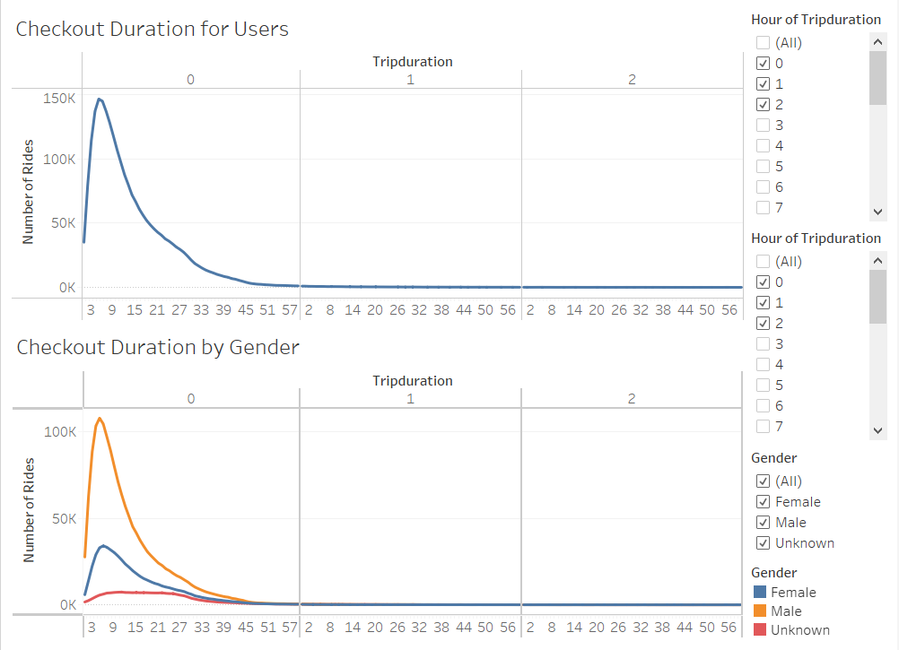
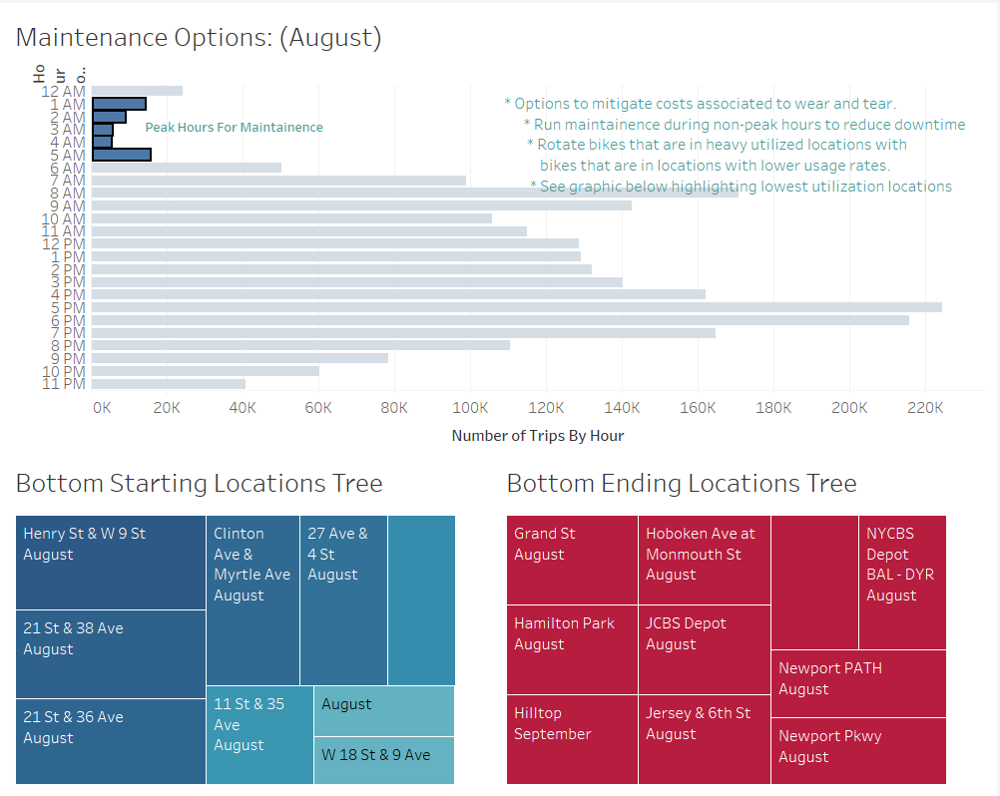

# Bike_Share_Challenge
Module 14
## Overview of Project:

The overview of this project is to create a visually stimulating story using Tableau that will inform and maintain the attention of the individuals reviewing the data  They will be able to flip through pages that will overlay information regarding Citi-Bike bike sharing business located in New York City and see if there is a potential use case in Des Moines Iowa.  We will achieve this by modifying the dataset using Python, Jupyter Lab, and Tableau.

### Purpose:
The purpose of this project is to create a data analysis through Tableau with direction from Kate to create attractive visualizations pulled from the dataset taken from a New York City set to help investors see the possibility of a successful launch of a bike share service in Des Moines.  The end product will be informative and draw up parallel between the two cities, while highlighting some of the more obvious differences.  Then a summary will be provided with suggestions of additional data that could be utilized to help the investors make a formed decision.

* A brief summary of the project will be written throughout the rest of this document but, the full report can be seen by accessing the link below.

[link to Tableau Data Story](https://public.tableau.com/app/profile/chad.thompson/viz/BikeShareChallenge_16434053059240/RideShare?publish=yes)

One of the drawbacks that Des Moines has starting a bike share business when compared to New York City is it's population.

* By referring to the images below, you can see how the two cities differ but, you will also notice some similarities.

 

As you can see, population is the biggest thing to take into consideration.  NYC has 8.5 million people and a population density of 28,000/sq. mile. Des Moines has only 213,000 and a population density of 2400/sq. mile.  With a population size and density like NYC, you will have access to more customers and there will be more locations in a "bikeable" range.  However, the median age of the two cities are roughly the same. Des Moines has a male to female population of 1:1.  While NYC has a male to female population of .9:1. It will become evident later in this report as to why that may be beneficial to Des Moines.

Another topic to consider would be the weather and how Des Moines and New York City Compare.

* The following two screenshots highlight that average temperatures and rainfall for both cities.

As you can see by from the information above, the weather profiles for both cities are quite similar.  Des Moines does have slightly less rainfall than NYC, which could allow for more "bikerideable" days.

Now onto the data pulled from the datasets provided.  After plotting the data, we can see the majority of the bike rentals were done by individuals who are on a subscriber plan.  This is good news for Des Moines as it shows that the usuage rates of the bike share service in NYC is impacted very little by tourism. It is locals that are using the service.  Also, the majority of the users of the service are males which, is good news for Des Moines as their male to female ratio is more evenly split than the ratio of NYC. 

By looking at the data from Tableau below we can see that during the week peak times are 7 a.m. to 9 a.m. and 5 p.m. to 7 p.m. Monday through Friday and usuage is evenly spread from 10 a.m. to 6 p.m. Saturday and Sunday.  We can see on the second heat map the ride intensity based on gender and subscriber vs non-subscribers. No real surprises here based on what we have seen previously.  

The heatmap below provides a bit more usuage data by breaking out the rider information for peak times by gender.  

Another piece of information that could be use to know but, may not necessarily apply 100% to our Des Moines ride share business model is average duration of rental.  From the data below, the average ride duration is approximately 6 minutes.  It only varies slightly between 5 minutes and 6 minutes for females and males respectively.  Once again, because of the population density in NYC and many locations are close, ride times will probably be lower than in Des Moines where the attractions/locations are spread further apart.

Research did not just focus solely on bringing a ride share business to Des Moines.  The research also focused briefly on identifying opportunities to run the business efficiently once it is in operation.  The plot below serves multiple purposes.  It contains a horizontal bar chart that not only shows the peak ride times but, it can also show when the bikes are not as heavily utilized, allowing for maintenance. Also, the tree plots below the bar chart shows the least busiest locations in NYC for the bike share service. This information could be used to determine whether or not having a station there is profitable. The information could also be used from a preventative maintenance perspective as well. It can identify bike that are not as heavily utilized and swap them with bikes at station that have heavier usuage.

## Results:

The result is a visually appealing and intersting story told by using the features of Tableau.  Tableau allows you to pull data from the dataset or use data acquired through calculations and apply visualizations to give your message more impact.  This Tableau story has met the criteria set forth by Kate in preperation of her presentation with potential investors.

## Summary:

Based on the data analyzed for this point, there still needs to be more research done to make an informed decision whether or not a bike share program could work in Des Moines.  New York City, because it is so compact, has many sites, features, restaurants and attractions with-in biking distance. Research would need to be done to find the best locations in Des Moines to put bike rental stations in areas that are of a "bikeable" distance.  A visualization highlighting the average distance traveled per rental would be great information to have.  Then we could map out from any bike station in Des Moines all of the attractions and locations that are available within the average distance traveled by the average New Yorker.  This will help us to decide strategically where we should place each station. Also, perhaps those in Des Moines are prepared to ride longer distances than what the New York data set shows.

The fact that the weather in Des Moines is comparable to NYC is a plus.  Also, seeing that an overwhelming majority of bike share users are males and not tourists favors Des Moines. Des Moines does not have a large tourist industry and the ratio of males to females is higher than in NYC. 
